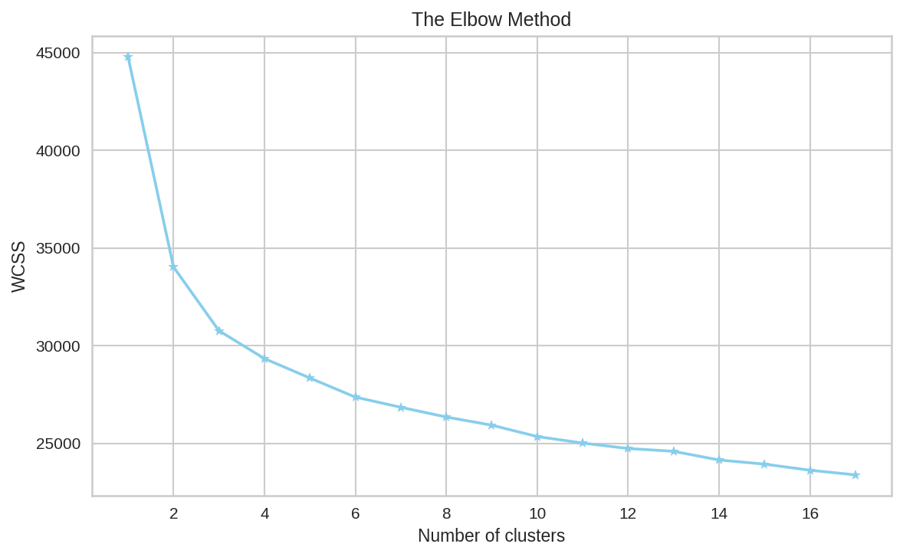
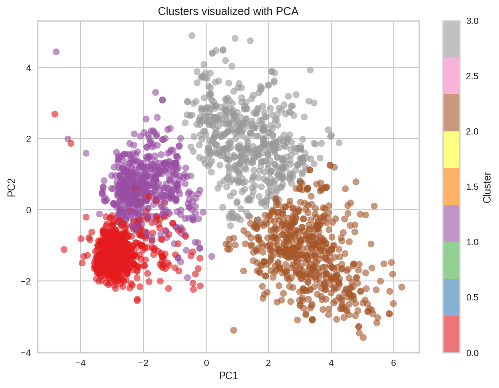
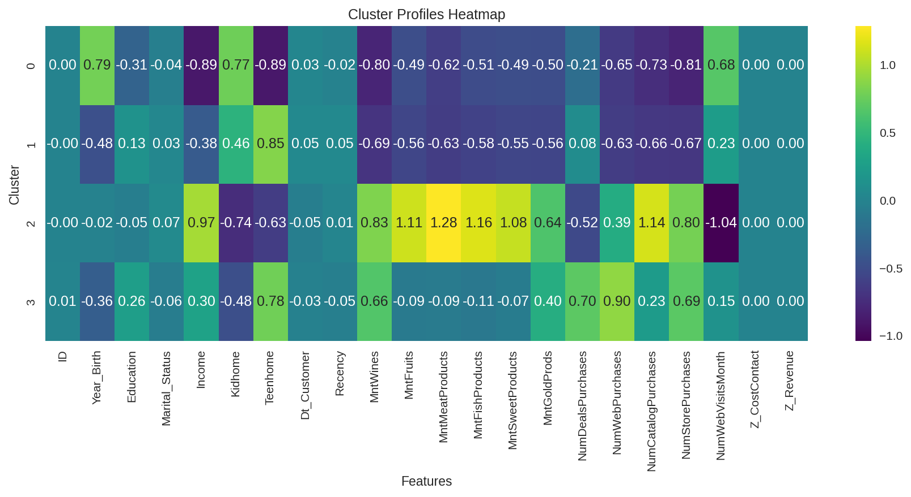
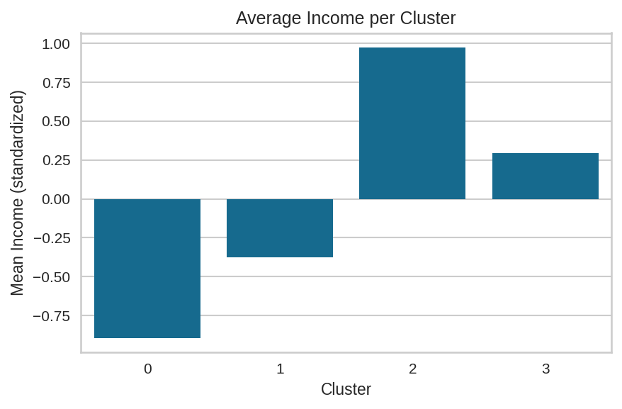
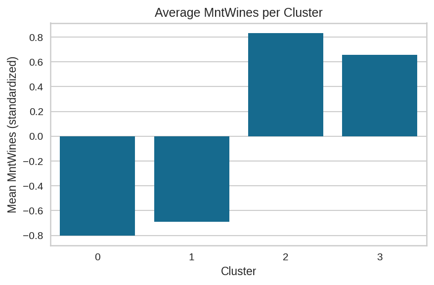

# Jupyter Notebooks

This folder will contain **Jupyter notebooks** for practical demonstrations.

## Planned structure
- `clustering/` → notebooks for algorithms such as KMeans, DBSCAN
- `dimensionality_reduction/` → notebooks for PCA and other methods

Each notebook will include:
- Step-by-step code
- Explanations
- Visualizations of results

### Elbow Method

### PCA Visualization

### Cluster Profiles Heatmap

### Example feature barplots

